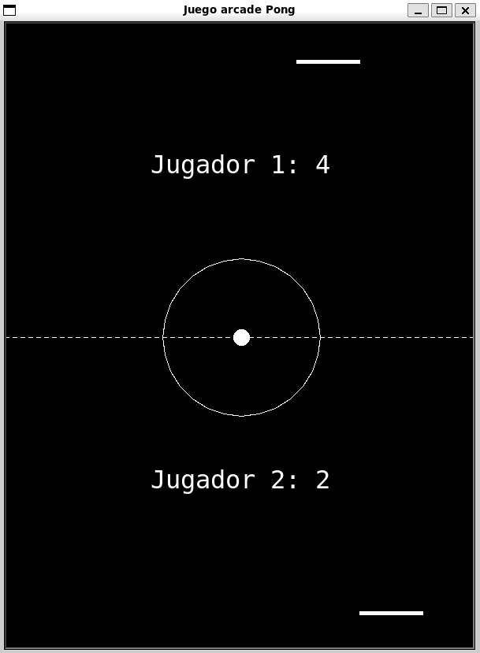

# Classic Pong Game with Python using Turtle

A classic implementation of the "Pong" arcade game developed using Python and the Turtle graphics library. This project serves as a fun and educational example of using Python for game development, illustrating fundamental concepts in programming.

## Features
- **Two Player Mode:** Play against another person on the same keyboard.
- **Score Keeping:** Tracks and displays player scores.
- **Simple Controls:** Easy to use keyboard controls for paddle movement.
- **Basic Collision Detection:** Handles ball and paddle interactions accurately.

## Screenshot


## Gameplay instructions
**Two player mode**: control de upper paddle with ``A`` (left) and ``D`` (right) keys, control the lower paddle with the ``Left Arrow`` and ``Right Arrow`` keys.

## Installation and Execution
1. Clone this repository:
   ```
   https://github.com/arnaunin/Arcade-Pong.git
   ```
2. Install the necessary dependencies (if any):
   ```
   pip install -r requirements.txt
   ```
3. Navigate into the cloned repository
   ```
   cd ruta-al.repositorio/
   ```
4. Run the project:
   ```
   python arcade_pong.py
   ```

## Contributing
Contributions are welcome! Please follow these steps:
1. **Fork the Repository**
2. **Create a Feature Branch (`git checkout -b feature-branch`)**
3. **Commit Your Changes (`git commit -m 'Add some feature'`)**
4. **Push to the Branch (`git push origin feature-branch`)**
5. **Open a Pull Request**


