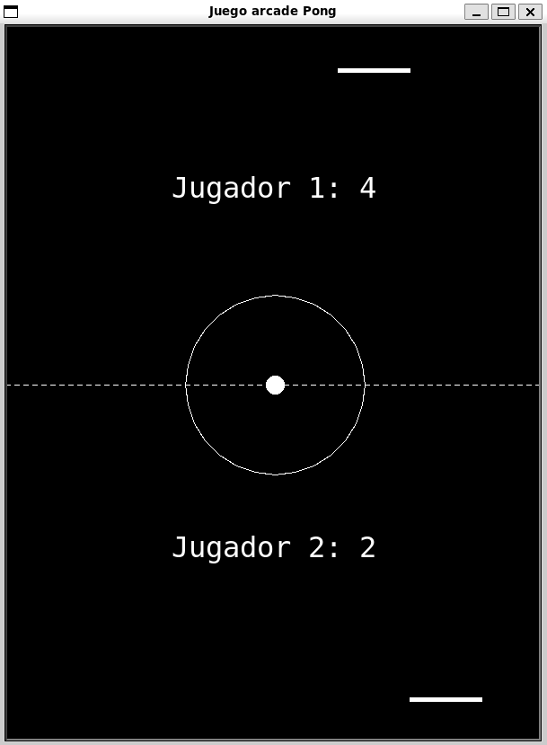

# Classic Pong Game with Python using Turtle

A classic implementation of the "Pong" arcade game developed using Python and the Turtle graphics library. This project serves as a fun and educational example of using Python for game development, illustrating fundamental concepts in programming.

## Features
- **Two Player Mode:** Play against another person on the same keyboard.
- **Score Keeping:** Tracks and displays player scores.
- **Simple Controls:** Easy to use keyboard controls for paddle movement.
- **Basic Collision Detection:** Handles ball and paddle interactions accurately.

## Screenshot
  
*Caption: Classic Pong game in action*

## Gameplay instructions
- **Two player mode:** control de upper paddle with the `A` (left) and `D` (right) keys, control de lower paddle with the with the `Left Arrow` and `Right Arrow` keys.

## Contributing
Contributions are welcome! Please follow these steps:
1. **Fork the Repository**
2. **Create a Feature Branch (`git checkout -b feature-branch`)**
3. **Commit Your Changes (`git commit -m 'Add some feature'`)**
4. **Push to the Branch (`git push origin feature-branch`)**
5. **Open a Pull Request**
